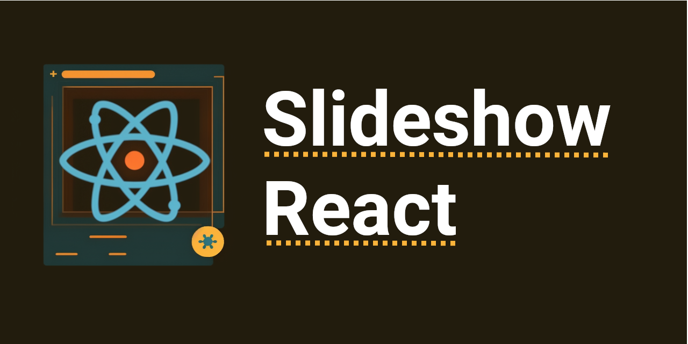

# Slideshow React

This library is still a heavy work in progress!

Create a slideshow with lazy loaded image (and other elements) using the IntersectionObserver API with support for thumbnails and scrolling. Styling/style sheets are not bundled with this library but examples of styling implementations can be seen in our storybook.

[Storybook Link](https://main--63dc6385f62009b5201ebeae.chromatic.com)
